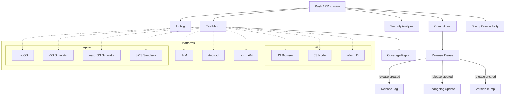

# CI/CD Documentation

This document describes the Continuous Integration and Continuous Deployment processes for the `fake-progress-lib`
project.

## Continuous Integration

The project uses GitHub Actions for Continuous Integration. The following workflows are triggered on every push and pull
request to the `main` branch.

### Workflow Pipeline

### Workflows

- **Test (`test.yml`)**: Runs the test suite across the configured platforms. Tier policy: only Kotlin/Native Tier 1 and
  Tier 2 targets that support running tests out of the box are executed; Tier 3 targets are excluded from CI test
  execution.
  - Collects and uploads test reports as artifacts on failure.
  - Generates a consolidated Kover coverage report after all tests pass.
  - Enforces a code coverage gate (minimum 80% instruction coverage).
  - Surfaces the coverage percentage in the workflow summary.
  - Native test matrix (Gradle tasks → runner):
    - `linuxX64Test` → `ubuntu-latest`
    - `macosArm64Test` → `macos-latest`
    - `iosSimulatorArm64Test` → `macos-latest`
    - `watchosSimulatorArm64Test` → `macos-latest`
    - `tvosSimulatorArm64Test` → `macos-latest`
  - Additional non-native tests:
    - JVM: `jvmTest` on `ubuntu-latest`
    - Android (host): `testAndroidHostTest` on `ubuntu-latest`
    - Web:
      - `jsBrowserTest` on `ubuntu-latest`
      - `jsNodeTest` on `ubuntu-latest`
      - `wasmJsBrowserTest` on `ubuntu-latest`
  - Not executed in CI: Tier 3 native targets (e.g., `mingwX64`, `iosX64`, Android NDK targets) and Tier 2 targets that
    do not support running tests on the available runners (e.g., `linuxArm64`).
- **Lint (`lint.yml`)**: Performs static code analysis via [detekt](https://detekt.dev/), using the
  `detekt-rules-libraries` plugin to enforce library API best practices (explicit return types, no public data classes,
  no unnecessarily public entities). Additionally, it runs the `checkKotlinBadge` task to verify that the Kotlin version
  badge in `README.md` stays in sync with the Kotlin version configured in the project (`gradle/libs.versions.toml`).
- **Binary Compatibility (`binary-compatibility.yml`)**: Validates Kotlin ABI binary compatibility against reference
  dumps using `./gradlew checkKotlinAbi` on pull requests targeting `main`. It also enforces a bridge check: if `.api`
  files are modified, the PR title must contain a conventional breaking change indicator (e.g., `feat!:`) to guarantee
  Release Please executes a major version bump.
- **Release (`release.yml`)**: Enforces conventional commits and automates versioning, changelog generation, and release
  tagging via [Release Please](https://github.com/googleapis/release-please).
  - **Commit Lint**: On every push to `main` or pull request targeting `main`, all commit messages (or the PR title for
    squash merges) are validated against the [Conventional Commits](https://www.conventionalcommits.org/) specification
    using [commitlint](https://commitlint.js.org/).
  - **Release Please**: On every push to `main`, Release Please inspects the commit history and, when releasable changes
    are present, opens or updates a release PR that bumps the version and updates `CHANGELOG.md`. Merging that PR
    creates a GitHub release and the corresponding version tag.

## Continuous Deployment

### GitHub Pages (Documentation)

A GitHub Actions workflow (`deploy-docs.yml`) is included to automatically build and deploy the documentation to GitHub
Pages on every push to the `main` branch.

### Library Publication

The library is configured to be published to Maven Central. The `.github/workflows/publish.yml` workflow handles the
publication process when a new release is created.
