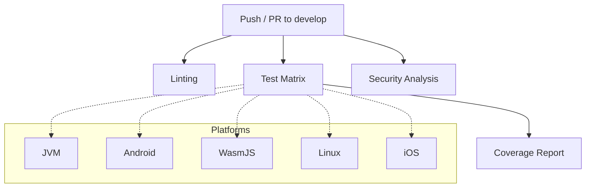

# CI/CD Documentation

This document describes the Continuous Integration and Continuous Deployment processes for the `fake-progress-lib`
project.

## Continuous Integration

The project uses GitHub Actions for Continuous Integration. The following workflows are triggered on every push and pull
request to the `develop` branch.

### Workflow Pipeline

### Workflows

- **Test (`test.yml`)**: Runs the test suite across all supported platforms (JVM, Android, WasmJS, Linux, and iOS).
  - Collects and uploads test reports as artifacts on failure.
  - Generates a consolidated Kover coverage report after all tests pass.
  - Enforces a code coverage gate (minimum 80% instruction coverage).
  - Surfaces the coverage percentage in the workflow summary.
- **Lint (`lint.yml`)**: Performs static code analysis via [detekt](https://detekt.dev/), using the
  `detekt-rules-libraries` plugin to enforce library API best practices (explicit return types, no public data classes,
  no unnecessarily public entities).

## Continuous Deployment

### GitHub Pages (Documentation)

A GitHub Actions workflow (`deploy-docs.yml`) is included to automatically build and deploy the documentation to GitHub
Pages on every push to the `develop` branch.

### Library Publication

The library is configured to be published to Maven Central. The `.github/workflows/publish.yml` workflow handles the
publication process when a new release is created.
